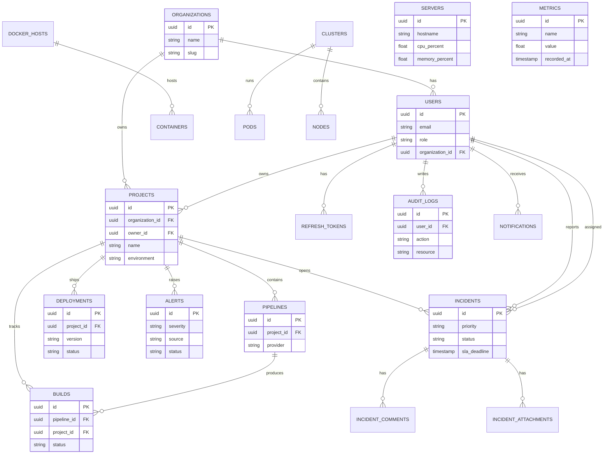

# Database ER Diagram

## Table Inventory

| Table | Purpose |
|-------|---------|
| users | Auth identities + RBAC roles |
| organizations | Multi-tenant org boundary |
| refresh_tokens | JWT refresh rotation |
| projects | Managed applications |
| pipelines | CI definitions |
| builds | Build history |
| deployments | Release history + rollback |
| docker_hosts / containers | Docker inventory cache |
| clusters / pods / nodes | Kubernetes inventory cache |
| servers | Host monitoring |
| alerts | Multi-source alerts |
| incidents (+ comments/attachments) | Incident management |
| metrics / logs | Telemetry |
| audit_logs | Security audit trail |
| notifications | In-app notifications |
